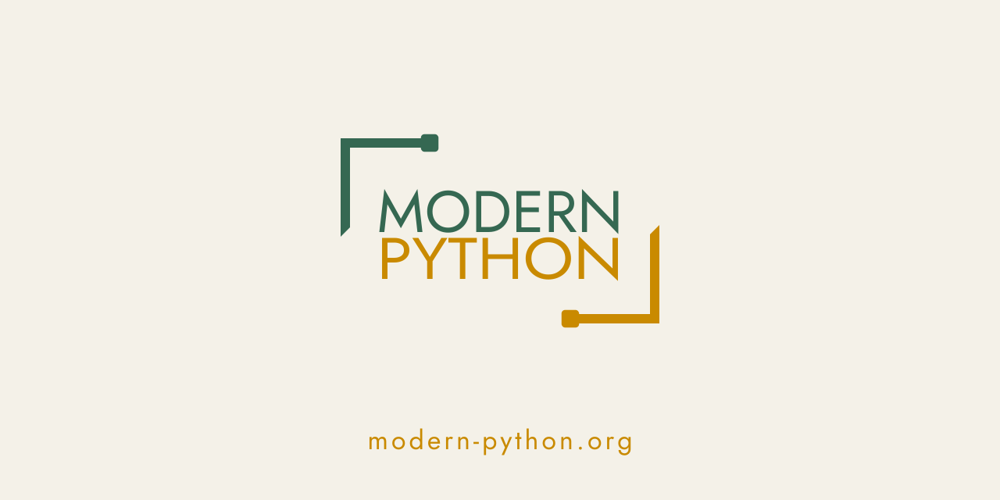

# Backstage: how the modern-python mark got made

A short story of the design session that produced the org favicon + social card —
the ideas, the dead-ends, and the pivots. (The little marks below are SVGs in
[`story-assets/`](story-assets); the finished assets live in [`org/`](org).)

---

## The starting point was an old favorite

We began with the original `MODERN / PYTHON` wordmark — corner brackets framing
thin caps. You liked it, but it had three problems: **no Python in it**, **too
welded to the text**, and **meaningless without the words**. So: start from the
beginning.

## Act 1 — finding the symbol

Four core directions went up in the browser companion:

*Syntax brackets `[ ]` · interlocked brackets · woven "snakes" · REPL prompt `>_`.*

You took **brackets** and **interlock**, then asked to go broader — with a note
that became the whole identity: *make them snake-like, square, no rounded
corners.* Dozens of square-snake sketches later, the winner was a **pinwheel with
square "block-head" snakes** (and its siblings):

## Act 2 — the family that never shipped (yet)

To make the ecosystem feel related, we studied how real icon families nest —
Adobe CC, JetBrains, AWS, Material — and chose a scheme where the frame stays
constant and an **inner glyph** marks each sub-family. I drew ~50 candidate
glyphs (node graphs, walrus `:=`, prompts, gears…). Then you made the smart call
to **narrow scope**: ship just the org favicon + social card now, defer the
per-project system. That saved us from painting the whole org before the org
mark was final.

## Act 3 — the wordmark fights back

The big lockup felt "not harmonic." First attempt: the brackets drifted off the
text (I was guessing letter widths). The fix was pinning the text to an exact
width so the corners always frame it. Then we chased the original's feel —
thinner letters, thinner crop-marks, breathing room — and on type asked *which
font says "modern"?* Geometric sans, the Bauhaus answer. Fifty options (Futura,
Avenir, Montserrat…), narrowed to **commercial-safe SIL OFL** faces, landing on
**Jost**, two-line caps, green `MODERN` / gold `PYTHON`:

## Act 4 — the icon gets teeth

For the standalone mark you first chose a **core dot**, then questioned what a dot
*means* (fair — nothing). The breakthrough: **push the snakes to the borders,
give them triangular tails, and try a chevron `>` inside.** We compared dot vs
chevron at true favicon sizes — chevron won:

&nbsp;&nbsp;&rarr;&nbsp;&nbsp;

It reads like a terminal prompt woven into a snake frame — Python *and* tooling
in one tile.

## Act 5 — the details that matter at 1024px

You caught what only shows up at full size: Telegram crops avatars to a **circle**
(so a full-bleed mark gets clipped → we added a padded variant), a **1px
tail/body seam**, and asked for the **tails on the social cards** too. The seam
fix overlapped the tail into the stroke — which you then caught *stepped the
inner edge*. The real fix: a 4-point tail that overlaps for the seam but starts
the inner diagonal exactly at the body's corner, so the line runs straight.

*Full-bleed for GitHub · padded for circular crops.*

---

From "where's the Python?" to a chevron-in-a-snake-frame that ships as a favicon,
a circle-safe avatar, and a wordmark social card. The brackets we started with
are still in there — they just grew tails and learned to hold a prompt.
